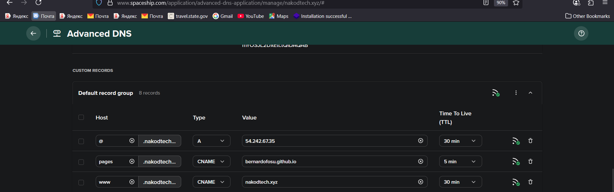
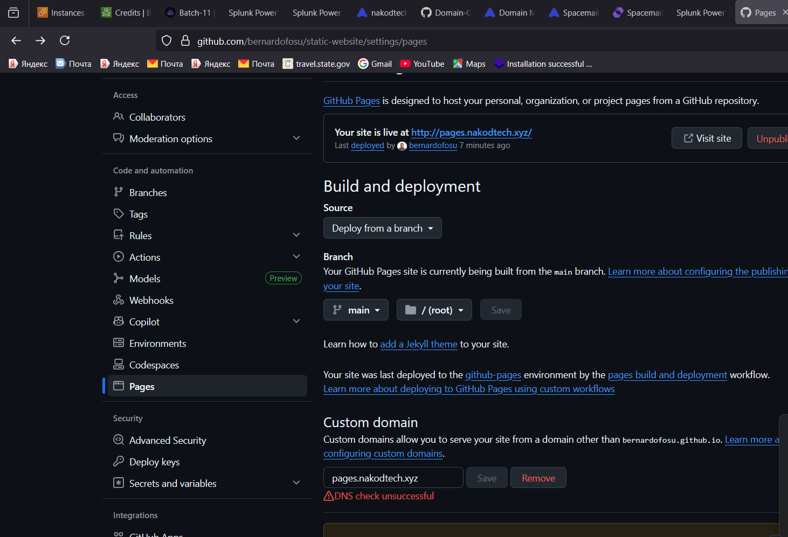
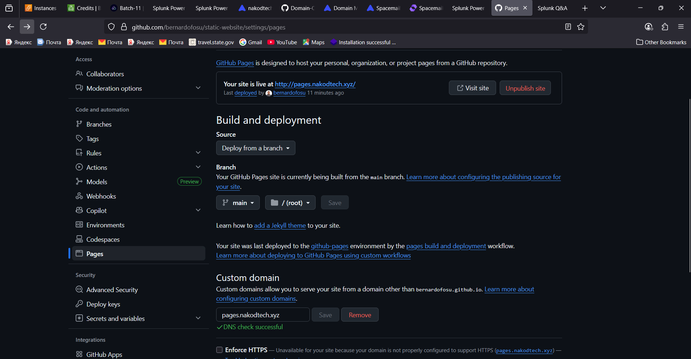

# 🚀 GitHub Pages + Spaceship DNS (CNAME + A)

A printable, step‑by‑step guide to publish a static site with **GitHub Pages** and connect it to your domain at **Spaceship DNS** — trying **both**:

* a **subdomain** via **CNAME** (e.g., `pages.nakodtech.xyz`)
* the **apex (root)** via **A/AAAA** records (e.g., `nakodtech.xyz`)

> Replace
>
> * `YOUR_GH_USERNAME` with your GitHub username
> * `yourdomain.tld` with your real domain (example below uses `nakodtech.xyz`)

---

## 1) 🆕 Create a new GitHub repo & simple page

1. Go to **GitHub → New repository**.
2. Name it anything (e.g., `hello-pages`). Keep **Public**.
3. **Add file → Create new file** → name: `index.html` and paste:

```html
<!doctype html>
<html>
  <head>
    <meta charset="utf-8" />
    <meta name="viewport" content="width=device-width,initial-scale=1" />
    <title>Hello Pages</title>
    <style>body{font:16px/1.6 system-ui;margin:5% auto;max-width:680px}
    h1{font-size:2.2rem} .tag{padding:.25em .5em;border-radius:.5em;background:#eef}
    </style>
  </head>
  <body>
    <h1>It works! ✨</h1>
    <p>This site is served by <span class="tag">GitHub Pages</span>.</p>
  </body>
</html>
```

4. **Commit** the file to the `main` branch.

---

## 2) 📄 Enable GitHub Pages

1. Repo **Settings → Pages**.
2. **Source:** *Deploy from a branch*.
3. **Branch:** `main` and **/(root)** → **Save**.
4. Wait \~30–60s until you see a green banner like:

   * **Your site is live at** `https://YOUR_GH_USERNAME.github.io/hello-pages/`
   * 
   * **Your site is live at** `https://bernardofosu.github.io/hello-pages/`

> 🧪 Open that URL to confirm the page loads.

GitHub Pages shows the “Your site is live at …” banner after the first Pages deploy finishes.

A deploy is triggered when you enable Pages (choose main + / (root) or /docs) and there’s content in that location.

So, do one of these:

Root option: put an index.html at the repo root.

/docs option: create a folder named docs/ and put docs/index.html inside it.


## 3) 🌐 Option A — Subdomain via CNAME (recommended to start)



We’ll map `pages.nakodtech.xyz` → your Pages site.

### 3.1 Add the custom domain in GitHub

* In **Settings → Pages → Custom domain**, enter:

  * `pages.nakodtech.xyz` → **Save**.
* GitHub creates/uses a `CNAME` file in your repo automatically.

>[!NOTE]
check **Enforce HTTPS** for github to issue cert for it to work. It will take time to become visible

### 3.2 Add DNS record at Spaceship

* **Spaceship → Library → Domain Manager → nakodtech.xyz → Nameservers & DNS → DNS records**
* Add this record:

| Host  | Type  | Value                        | TTL |
| ----- | ----- | ---------------------------- | --- |
| pages | CNAME | `YOUR_GH_USERNAME.github.io.` | 300 |


>[!NOTE]
eg. bernardofosugithub.io both will work bernardofosu.github.io and bernardofosu.github.io. and dot at the end

We will wait for sometime



And you will see


> ⏳ Wait 2–10 min. Then click **Verify** in GitHub Pages. Finally toggle **Enforce HTTPS** when it appears.

✅ Now `https://pages.nakodtech.xyz` should show your site.

---

## 4) 🌳 Option B — Apex (root) via A/AAAA

This maps **`nakodtech.xyz`** to GitHub Pages **IP addresses**. **⚠️ Warning:** your apex can only point to **one place**. If `nakodtech.xyz` currently points to an EC2/Nginx server, switching to Pages will replace that.

### 4.1 Add the custom domain in GitHub

* **Settings → Pages → Custom domain**: `nakodtech.xyz` → **Save**.

### 4.2 Add A/AAAA records at Spaceship

* Create **four A** records (IPv4):

| Host | Type | Value           | TTL |
| ---- | ---- | --------------- | --- |
| @    | A    | 185.199.108.153 | 300 |
| @    | A    | 185.199.109.153 | 300 |
| @    | A    | 185.199.110.153 | 300 |
| @    | A    | 185.199.111.153 | 300 |

* *(Optional)* add **four AAAA** (IPv6) records:

| Host | Type | Value               | TTL |
| ---- | ---- | ------------------- | --- |
| @    | AAAA | 2606:50c0:8000::153 | 300 |
| @    | AAAA | 2606:50c0:8001::153 | 300 |
| @    | AAAA | 2606:50c0:8002::153 | 300 |
| @    | AAAA | 2606:50c0:8003::153 | 300 |

> ⏳ Wait a few minutes, then **Verify** the domain in GitHub Pages and enable **Enforce HTTPS**.

✅ Now `https://nakodtech.xyz` should show the same page.

---

## 5) 🔁 Keep apex on EC2 and Pages on a subdomain (hybrid)

If you want to keep your EC2 site on the root and use Pages only on a subdomain, do:

* Keep your existing root **A** record (`@ → EC2_IP`).
* Use **Option A** above for `pages.nakodtech.xyz`.

> This is the safest way to experiment without touching your main site.

---

## 6) 🔒 Certificates & HTTPS

* GitHub issues/renews HTTPS certs **automatically** for your custom domain once DNS is correct and **Enforce HTTPS** is on.
* No certs to manage on your side for GitHub Pages.

---

## 7) 🧹 Troubleshooting

* **DNS not verified?** Use `dig`:

  ```bash
  dig +short pages.nakodtech.xyz CNAME
  dig +short nakodtech.xyz A
  dig +short nakodtech.xyz AAAA
  ```
* **Conflicting apex?** Remove other `@` A/AAAA/CNAME records when pointing root to Pages.
* **WWW fails?** Add **www CNAME yourdomain.tld** so `www` follows the apex.

---

## 8) ✅ Quick checklist

* [ ] Repo created & `index.html` committed
* [ ] Pages enabled (Deploy from a branch → `main` /root)
* [ ] Custom domain set in GitHub Pages
* [ ] DNS added in Spaceship (CNAME for subdomain, A/AAAA for apex)
* [ ] Verified in GitHub Pages → **Enforce HTTPS** toggled
* [ ] Site loads at your custom domain 🎉

---

## 9) 💡 Nice-to-haves

* **HSTS** on your apex (if you serve through your own Nginx/EC2):

  ```nginx
  add_header Strict-Transport-Security "max-age=31536000; includeSubDomains" always;
  ```
* **CAA** at your domain:

  ```
  @ CAA 0 issue "letsencrypt.org"
  ```

  (Harmless with GitHub Pages; limits CA issuance for services you host elsewhere.)

---

## 10) 🧭 Example layouts at Spaceship DNS

**Hybrid:** root on EC2, Pages on subdomain

```
@      A      52.2.240.181           ; EC2
www    CNAME  nakodtech.xyz          ; www → apex
pages  CNAME  YOUR_GH_USERNAME.github.io
```

**All Pages:** root and www to GitHub

```
@      A      185.199.108.153
@      A      185.199.109.153
@      A      185.199.110.153
@      A      185.199.111.153
www    CNAME  nakodtech.xyz
```

---

Happy shipping! 🛸✨
