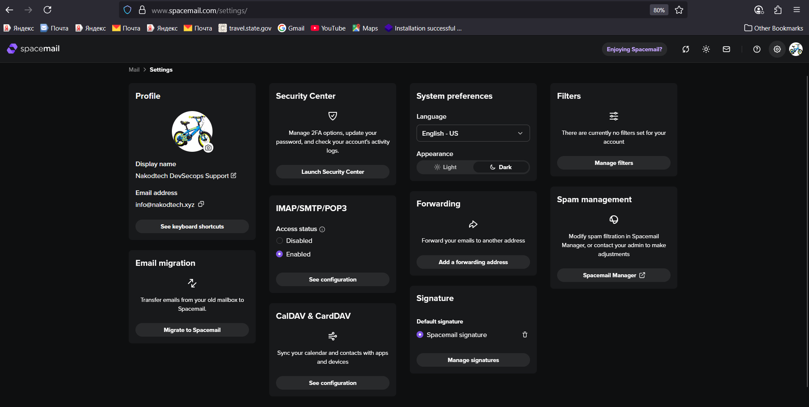

# 🧑‍💼 Profile setup – brand name + logo



> Use this mini‑playbook to show your **brand name** in the From line and your **logo/avatar** next to messages.

---

## ✅ A. Show your brand **name** (From line)

1. **Spacemail** → **Settings › Profile** → **Display name** → set to something like **Nakodtech** or **Nakodtech Support** → **Save**. ✍️
2. **Thunderbird** → **Account Settings** → **Your Name** → use the same value → **OK**. 📨

Your recipients will see: **Nakodtech [info@nakodtech.xyz](mailto:info@nakodtech.xyz)**.

---

## 🛡️ B. Show your **brand logo/avatar** (BIMI)

To get a logo chip in inboxes (especially Gmail) you’ll use **BIMI** and **DMARC**.

### Prereqs

* **DMARC at enforcement** (Gmail won’t show logos with `p=none`).
* **SPF & DKIM** working/aligned (you have them ✅).
* **Square SVG logo** (SVG Tiny P/S, no external refs; keep small). Place it at:

  * `https://nakodtech.xyz/.well-known/bimi/logo.svg` 🖼️
* **VMC certificate** (optional but required by Gmail to show the avatar):

  * Host it at `https://nakodtech.xyz/.well-known/bimi/vmc.pem` 🔏

### Update DMARC (DNS → TXT)

```
Host: _dmarc
Type: TXT
Value: v=DMARC1; p=quarantine; pct=100; rua=mailto:dmarc@nakodtech.xyz; ruf=mailto:dmarc@nakodtech.xyz; fo=1; aspf=r; adkim=r
```

> Nervous? Start with `pct=25`, then 50 → 100 after you confirm delivery. ⏱️

### Add BIMI (DNS → TXT)

**With VMC**

```
Host: default._bimi
Type: TXT
Value: v=BIMI1; l=https://nakodtech.xyz/.well-known/bimi/logo.svg; a=https://nakodtech.xyz/.well-known/bimi/vmc.pem
```

**Without VMC** (works for Yahoo/AOL; Gmail usually needs VMC)

```
Host: default._bimi
Type: TXT
Value: v=BIMI1; l=https://nakodtech.xyz/.well-known/bimi/logo.svg; a=
```

### Test 🧪

```
dig +short TXT _dmarc.nakodtech.xyz @1.1.1.1
dig +short default._bimi.nakodtech.xyz TXT @1.1.1.1
```

Use an online **BIMI inspector** to validate SVG + records. Gmail can take a few days to start showing the logo. ⏳

---

## ✍️ C. Add an **email signature** with logo (inside the message)

This doesn’t control the avatar chip, but gives consistent branding in the body.

**Spacemail** → **Settings › Manage signatures** → **Add new signature** → insert this HTML:

```html
<table role="presentation" cellspacing="0" cellpadding="0" border="0">
  <tr>
    <td valign="middle" style="padding:8px 0">
      
    </td>
  </tr>
  <tr>
    <td style="font:14px/1.4 system-ui,-apple-system,Segoe UI,Roboto,Arial,sans-serif;color:#111">
      <strong>Nakodtech</strong><br>
      <a href="https://nakodtech.xyz" style="color:#4f46e5;text-decoration:none">nakodtech.xyz</a>
    </td>
  </tr>
</table>
```

Set as **Default signature** → **Save**. ✅

> Keep the image hosted (not attached) and \~160–240px wide for crisp rendering. 🖼️

---

## 🧾 Quick checklist

* [ ] Spacemail **Display name** set (brand name)
* [ ] Thunderbird **Your Name** matches
* [ ] DMARC set to **p=quarantine** (or **p=reject**)
* [ ] BIMI TXT published (+ **VMC** for Gmail avatar)
* [ ] Signature with logo created in Spacemail

Happy branding! 🚀
